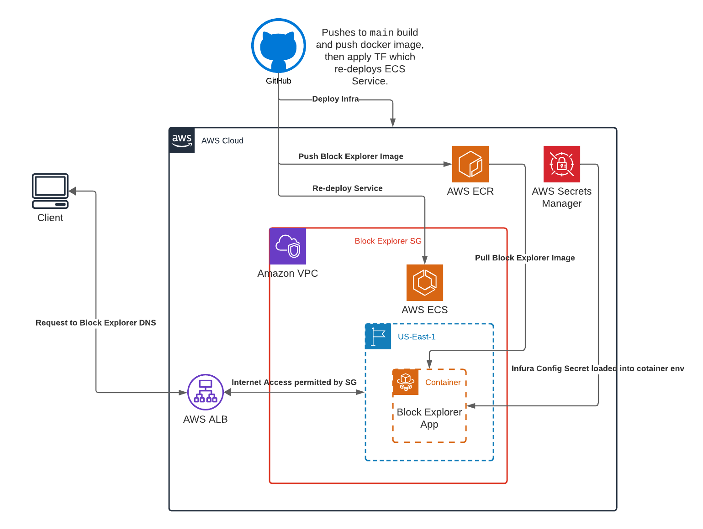

# Block Explorer

A Basic Block Explorer


## Make
All App Entrypoints are routed through a `Makefile`. The following commands are available:
```shell
$ make start             # starts the app
$ make build             # builds app dependencies
$ make deploy            # deploys the app
$ make ci                # tests the app
$ make requirements.txt  # compile app requirements
```

## Requirements

### Technologies
```shell
Python ~= 3.10
Terraform ~= 1.5
```

### Cloud Configuration

* AWS Secrets Manager JSON secret named `INFURA_CONFIG`
    * `API_KEY`: Infura API Key
    * `BASE_URL`: Infura API Base URL (e.g. `https://mainnet.infura.io/v3/`)
* AWS VPC with public subnets
* AWS S3 bucket for TF state


## Architecture


[Comment on Lucid Diagram!](https://lucid.app/lucidchart/e24f71af-2616-485f-98a6-16adba994ed9/edit?viewport_loc=-19%2C-93%2C2071%2C1468%2C0_0&invitationId=inv_8c12b174-cd52-4d16-b23e-086aea55d149)
